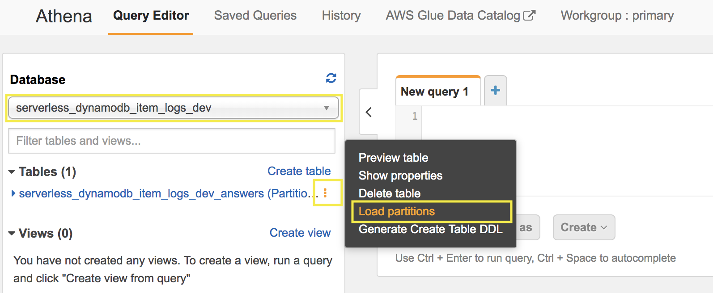
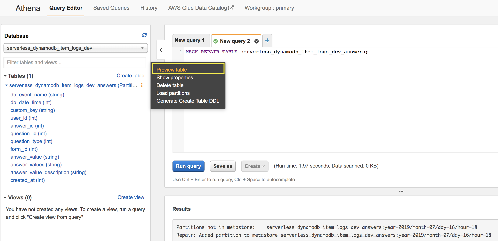
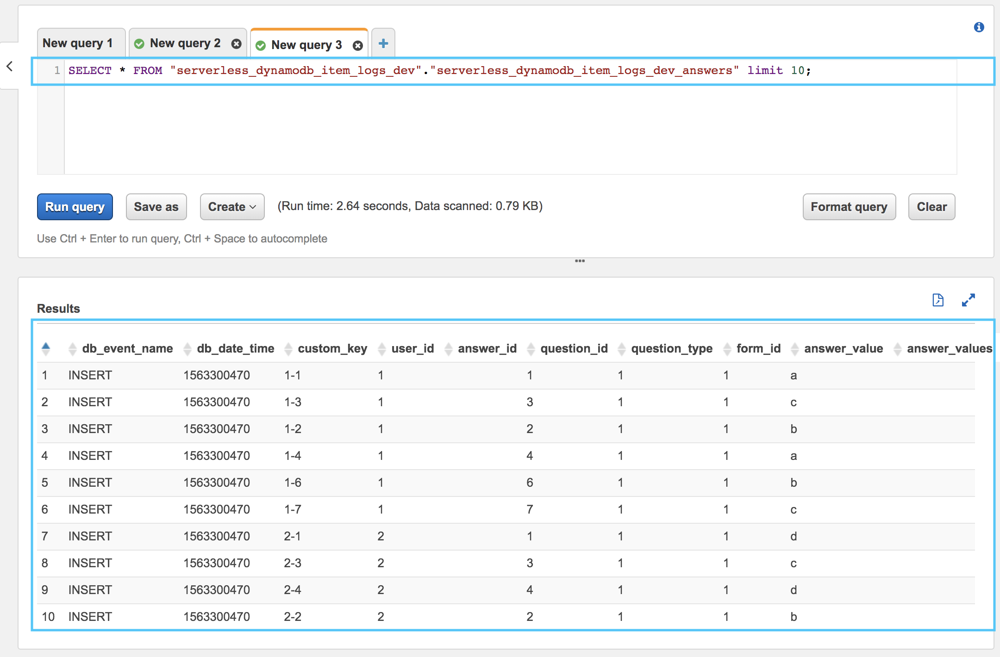

# Capturing table activity with DynamoDB Streams

Work inside your AWS Cloud9 or local environment to deploy the following Serverless project that creates a flow to deliver changes in items from your DynamoDB table to an Amazon S3 bucket to be query in Amazon Athena.


## Configure your environment

- In AWS Cloud9 configure the AWS CLI using the default credentials, and set the region name to **`us-east-1`** and the output format to **`json`**. 

``` bash
aws configure
```

- First item
- Second item
- Third item
    - Indented item
    - Indented item
- Fourth item

    - AWS Access Key ID: **(Use default)**
    - AWS Secret Access Key: **(Use default)**
    - Default region name [us-east-1]: **us-east-1**
    - Default output format [json]: **json**

- In your local environment [configure the AWS CLI](https://docs.aws.amazon.com/cli/latest/userguide/cli-chap-configure.html#cli-quick-configuration).

## Install dependencies

Update Node.js to the minimal version of 8.

``` bash
nvm i v8
```

Install Serverless CLI tool https://serverless.com/framework/docs/providers/aws/guide/installation/

``` bash
npm install -g serverless
```

## Create a Serverless project

``` bash
git clone https://github.com/aurbac/serverless-dynamodb-item-logs.git
cd serverless-dynamodb-item-logs
```

## Deploy your Serverless project

``` bash
serverless deploy
```

## Testing

``` bash
export ANSWERS_TABLE=serverless_dynamodb_item_logs_dev_answers
python batch_writing.py
```

!!! info
    Wait about 5 minutes until the records are processed by AWS Firehose and delivered to Amazon S3.

Go to the Amazon Athena console https://us-east-1.console.aws.amazon.com/athena.

Select your **serverless_dynamodb_item_logs_dev** database and choose the **...** next to your table and choose **Load Partitions**.



Choose the **...** next to your table and choose **Preview table**.



Example of query result.

